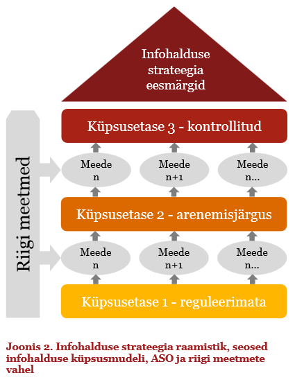
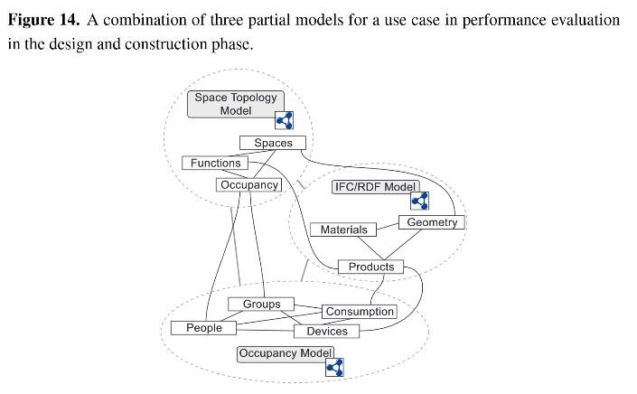

# Riigi kinnisvara infohalduse strateegia
Staatus: [draft](https://github.com/kinnisvara/infohaldus/edit/master/kinnisvara_infohalduse_strateegia.md)

## Sissejuhatus
Riigi kinnisvara infohalduse strateegia alusteks on strateegia "[Dokumendihalduselt infohaldusele](https://www.mkm.ee/sites/default/files/dokumendihalduselt_infohaldusele_strateegia_1.9.pdf)" ja selle [alusdokument](https://www.mkm.ee/sites/default/files/lopparuanne_-_dokumendi-_ja_infohalduse_hetkeolukorra_ja_rahvusvaheliste_kogemuste_analuus_1_2.0.pdf) ning projekti "[Riigi kinnisvara kasutusnormatiivide väljatöötamine ja rakendamine riigi eelarveprotsessis](http://riigivara.fin.ee/lr1/web/guest/tof)" [tulemused](https://github.com/kinnisvara/infohaldus/tree/master/tof).

### Strateegias kasutatavad mõisted

### Töö metoodika

## Visioon ja eesmärgid

Kinnisvara infohalduse konkreetse sihttaseme püstitamiseks kasutame [infohalduse küpsusmudeli](https://www.mkm.ee/sites/default/files/dokumendihalduselt_infohaldusele_strateegia_1.9.pdf#page=31&zoom=auto,71,465) tasemete määratlusi ning seame eesmärgi jõuda aastaks 2020 vähemalt **kontrollitud** (kolmandale) tasemele. Sellel tasemel on põhilised infohalduse vajadused kaetud kontrollitud viisil ning organisatsiooni põhiprotsessid on kirjeldatud ja arendatavad, regulatsioone täidetakse ning kohustustega tullakse toime. Neljas tase on **ennetav** ja viies **ümberkujundatud**.

Infohalduse küpsusmudeli kolmanda taseme kriteeriumite saavutamisel on võimalik riigi infohalduse [strateegia eesmärkide](https://www.mkm.ee/sites/default/files/dokumendihalduselt_infohaldusele_strateegia_1.9.pdf#page=9&zoom=auto,48,205) täitumine ja „Infoühiskonna arengukavas 2020“ seatud nutikama riigivalitsemise eesmärkide täitmine.

### Lahendamist vajavad probleemid
* riigi kinnisvara andmekogude nõrk koosvõime, peamisteks põhjusteks andmete koosseisu, kvaliteedi ja semantika erinevused
* vajalik info ei ole kättesaadav (puudulikud infomudelid, info halb kvaliteet)
* raiskamine info mitmekordsel taastootmisel
* kallid, ebaefektiivsed ja paindumatud infosüsteemid

### Visioon: terviklik hästi korraldatud riigi kinnisvara infohaldus

### Riigi kinnisvara infohalduse strateegia eesmärgid

#### **Kvaliteetsem töö- ja elukeskkond**

#### **Efektiivsem riik** 
_Aastal 2020 peab riik toime tulema viiendiku võrra väiksema eelarvega ning pakkuma vähemalt samas mahus vähemalt sama kvaliteediga avalikke teenuseid._

#### **Informeeritumad otsused**

### Seonduvad initsiatiivid

* [e-ehitus](http://e-ehitis.ee/)
* https://www.mkm.ee/et/tegevused-eesmargid/infouhiskond/dokumendihaldusest-infohalduseni

## Meetmed eesmärkideni jõudmiseks, tegevused ja mõõdikud

### Semantikavarade haldamise rakendamine

Riigi kinnisvaravaldkonnas tuleb süstemaatiliselt hakata semantikavarasid haldama. Selleks tuleb esmalt luua andmete semantiliseks kirjeldamiseks vajalik **kontseptsioon** (ontoloogia OWL vormingus, [#2](https://github.com/kinnisvara/infohaldus/issues/2)) ja seejärel **kirjeldada andmeteenused ja -koosseisud** ([kirjeldamise juhis](https://github.com/kinnisvara/infohaldus/blob/master/materjalid/semantilise_kirjeldamise_juhis_v04.PDF)). 

- Semantikavarade haldamine peab olema järjepidev.

- Semantikavarade haldamine peab olema taaskasutav - uute mõistete loomist paralleelselt olemasolevate kõrvale tuleb vältida. Selle asemel tuleb taotleda olemasoleva täiendamist vastavalt muudatusvajadusele.

Kinnisvaravaldkonna semantika parim praktika:
* OSCRE: http://www.oscre.org/index.php/oscre-resources/choose-and-use
* openBIM IFC: http://www.buildingsmart-tech.org/specifications/ifc-overview
* http://www.bimtaskgroup.org/wp-content/uploads/2014/09/The-Asset-Information-Model-using-BIM.pdf
* http://shop.bsigroup.com/SearchResults/?q=1192

[Figure 7](http://www.bimtaskgroup.org/wp-content/uploads/2014/09/The-Asset-Information-Model-using-BIM.pdf) provides an overview of how the organisation can approach the development of its information requirements and how the information relates to the Asset Information Model (AIM) PAS 1192:3 and the Project Information Model (PIM) PAS 1192:2, http://www.bimtaskgroup.org/wp-content/uploads/2014/09/The-Asset-Information-Model-using-BIM.pdf

### Õigusloome protsessi parendamine

Õigusloomele peab eelnema äriprotsessi kirjeldamine ja semantika ühtlustamine.

### Kinnisvara infohalduse parimate praktikate rakendamine

Kinnisvara ja ehitiste infohalduses BIM'i rakendamise majanduslik sääst võib uuringutele ja teiste riikide kogemusele tuginedes olla märkimisväärne: 
* [Digital Built Britain, Ühendkuningriigid](http://www.buildingsmart.org/2015/03/03/digital-built-britain-launch/): The standards and savings delivered by the BIM level 2 initiative has been central to the __£840M savings achieved on central public spend in 2013/14__. [@nick_tune #BIMsday](https://twitter.com/FINAL_CAD/status/611436392258891776): The main rationale for the UK gov to introduce the mandate on #BIM was to reduce costs. __£1.7B saved between '11 and '14__.
* [Rijkswaterstaat, Holland](https://www.rijkswaterstaat.nl/en/images/Factsheet%20Design%20Standards%20-%20open%20Building%20Information%20Modelling_tcm224-340520.pdf): *By implementing BIM in the infra sector, road authorities will reduce failure costs and transaction costs. Studies have shown that __savings can be up to 10% of the building costs__*.
* [NIST, USA](http://catenda.no/archives/1923): *you __can save 2-3 USD per square meter per year__ by use of open BIM in facility management*.

### Knowledge management ja Continuous improvement põhimõtete rakendamine äriprotsesside ja teenuste haldamisel

[Continuous improvement](http://businesscasestudies.co.uk/corus/continuous-improvement-as-a-business-strategy/continuous-improvement.html#axzz3dLCJSEHA)

### Avaandmete, Linked Data kasutamine

* Pieter Pauwels, Davy Van Deursen, Leandro Madrazo, Gonçal Costa, Leif Granholm, Edward Corry, Edward Curry, James O'Donnell, Seppo Törmä, Jyrki Oraskari, Nam Vu Hoang. **[Supporting Decision-Making in the Building Lifecycle using Linked Data](https://github.com/kinnisvara/infohaldus/blob/master/materjalid/buildings-04-00549.pdf)**. In First International Workshop on Linked Data in Architecture and Construction: Workshop Report (2012) 12-18

### Avatud lähtekoodiga sisuhaldusraamistiku kasutuselevõtmine
Sisuhaldusraamistiku ([#](http://www.wunderkraut.ee/drupal)) kasutamine võimaldab kiiret ja agiilset arendusprotsessi, laialdast kohandumist ja **väiksemat kogukulu omanikule**:
* The Energy.gov build has resulted in **cost savings upward of $10 million annually** to taxpayers, through the **consolidation of duplicative digital technology platforms and expensive internal hosting solutions, along with using the Drupal platform** to disseminate information for new initiatives, rather than building new, stand-alone websites. [Allikas](http://www.governing.com/news/technology/Why-Big-Government-Sites-Run-Drupal-.html)
* The Georgia Technology Authority (GTA) will save the state approximately **$4.7 million over the next five years** **by using an open source website content management system and hosting data in the cloud**. [Allikas](http://www.govtech.com/Georgia-Saving-Millions-with-Open-Source-Technology.html)

Töövahendite arendamisel tuleb lähtuda avatusest, koostööst ja pidevast parendamisest:
* http://wunderkraut.github.io/WunderFlow/
* [More Bang for Your Buck: How Open Source Software Spurs International Development](https://medium.com/the-exchange-k4health/more-bang-for-your-buck-how-open-source-software-spurs-international-development-809efdfbcdca)
* http://energy.gov/eere/buildings/open-source-strategy

## Mõõdikud ja seire

## Riskid

## Lisad
